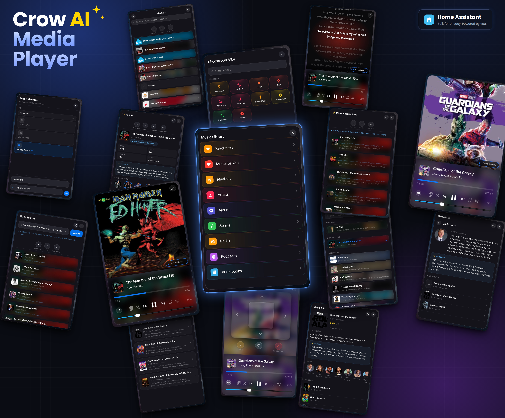

# CrowAI Media Player Card

CrowAI is a Home Assistant media player card built specifically for **iPhone**. Designed from the ground up for iPhone, it brings frosted-glass aesthetics, fluid touch animations, full Music Assistant integration, synced lyrics, a queue browser, multi-room multicast playback, rich AI-powered media info panels, and an Apple TV remote — all in a card that feels like a native iPhone app.

> ⚠️ **Music Assistant is required** for the Music Library browser, queue management, Vibe Queue Builder, AI Artist Radio, multi-room multicast playback and all MA-specific features.

> ⚠️ **Music Assistant Queue Actions is required** for the Recommended tab, Queue Browser and Library drill-in.

> ⚠️ **Google Gemini is required** for all AI features — AI Info Panel, Vibe Queue Builder, AI Search, Recommendations, AI Artist Radio, Announce AI Improve and Send Message AI.



## Key Features

- **Built for iPhone** — every interaction is optimised for iPhone; touch targets, long-press suppression and layout are all iPhone-first
- **Modern Design** — frosted-glass theme with rounded corners, smooth animations and customisable accent colours
- **Player Icon Themes** — eight icon sets: Standard, Modern, Robot (default), Chunky, Retro Player, Sharp, Pixel and LCD
- **Artwork Crossfade** — optional cinematic fade-to-black transition between track changes
- **Apple TV Remote** — built-in remote overlay with directional pad, Back, TV and Power Off
- **Tactile Button Feedback** — glow and blur effects when buttons are pressed
- **Automatic Device Switching** — card follows whichever media player starts playing
- **Compact and Expanded Modes** — toggle between full album art and a space-saving mini player
- **Full Media Controls** — play/pause, track navigation, shuffle, repeat, seek and mute
- **Double-tap to Seek** — double-tap the left or right zone of artwork to seek −15s or +15s
- **Artwork Tap Actions** — single-tap opens AI Info (music) or Media Info (TV/movies); double-tap the left or right side to seek −15s/+15s; long-press opens lyrics
- **Artwork Zoom** — tap the mini album art in AI Info or album view to see a larger version
- **Mute Toggle** — tap the volume percentage badge or speaker icon to instantly mute/unmute
- **Live Progress Tracking** — real-time playback position updates
- **Multi-Device Management** — control Apple TV, HomePod and Music Assistant speakers from a single card
- **Volume Control** — slider or +/− buttons, with optional routing to a separate volume entity
- **Album Artwork** — automatic iTunes artwork lookup when no artwork is provided
- **Ambient Glow** — extracts dominant colour from album artwork and applies a subtle glow
- **Radio Mode Indicator** — tap the radio icon to turn radio mode off immediately
- **In-card Notifications** — toast alerts appear inside the card

## AI Features

All AI features are powered by **Google Gemini** (required) via Home Assistant's conversation integration.

**Setup:** Install the **Google Generative AI** integration in HA, select **`gemini-2.0-flash`** as the model, ensure the **Generative Language API** is enabled in [Google Cloud Console](https://console.cloud.google.com), then select **Google AI Conversation** as the AI Agent in the card's visual editor.

**Free tier limits (gemini-2.0-flash):** 1,500 requests/day · 15 requests/minute — sufficient for normal daily use.

- **AI Info Panel** — single-tap the artwork while music plays: year, label, length, fun fact, genre tags, band members / artist section, album pill, similar tracks; all cached per track
- **Vibe Queue Builder** — 100+ vibes across Energy, Calm, Focus, Mood, Social, Decades, Genre, Time, Seasons and Binaural & Noise; builds a themed MA queue instantly; artist exclusion prevents repeats
- **AI Search** — natural language search across your MA library
- **Recommendations** — AI-curated track suggestions based on what's playing
- **AI Artist Radio** — continuous radio queue around any artist
- **Announce AI Improve** — rewrites your announcement in a natural, friendly tone
- **Send Message AI** — improves your notification text

## Quick Menu

Tap the playlist/queue button in the controls bar to open the contextual quick menu:

- **Queue** — opens the queue panel (MA speakers only)
- **AI Search** — natural language MA search
- **Music Library** — opens the MA library browser (MA speakers only)
- **Vibe** — opens the Vibe Queue Builder
- **Recommendations** — AI track recommendations
- **Add Similar Songs** — adds AI-suggested similar tracks to the queue
- **AI Artist Radio** — builds an artist radio queue
- **Radio Mode** — toggles MA radio mode on/off
- **Lyrics** — toggles the lyrics panel
- **Announce** — opens the Announce panel
- **Send Message** — opens the Send Message panel
- **Share** — copies track info plus a link to your chosen music service (see Sharing below)
- **More Info** — opens the AI/Media Info panel

## Speaker Selector Menu

Tap the broadcast icon to open a popup showing all configured media players. Tap any entry to switch.

## Multi-Room Multicast

Play the same audio on multiple MA speakers simultaneously:

- **Speaker pills** — always visible; one per active grouped speaker; locked while a queue is building
- **Focus for volume** — tap any pill to control that speaker independently
- **Sync volumes** — match all grouped speakers to the focused speaker's volume
- **Add a speaker** — a **+ Add** pill appears when additional MA speakers are available
- **Remove a speaker** — tap the × on any pill to remove that speaker from the group

## Synced Lyrics

Long-press the artwork while music is playing to open the full-screen lyrics panel. Single-tap to close.

- Real-time line highlighting with auto-scroll
- Double-tap to pause/resume auto-scrolling
- Plain lyrics fallback when timestamps aren't available
- Background prefetch — opens instantly
- Auto-close when track ends or changes

## Sharing

Share is available from the quick menu, the AI Info / Media Info panels, and the long-press menu on any queue row. It copies everything to the clipboard — there's a toast confirmation when it's done.

- **Music** — copies the track title and artist (plus album, where shown) along with a link to find the track on your chosen streaming service
- **Movies & TV** — copies the title, year and a short synopsis along with a link to find it on TheMovieDB
- **Choose your service** — pick the destination for music links in AI Settings: YouTube Music (default), Apple Music, Spotify, Tidal, Amazon Music or Deezer

## Media Info Panels

**Single-tap** the artwork to open the relevant info panel.

**Music — AI Info Panel:**
- Year, label, length, fun fact, genre tags
- Album pill — tap to open the album and browse its tracks; tap album art to zoom
- Band Members / Artist — tap any member to open their bio with photo (tap to zoom), Known For songs and fun fact
- Similar Tracks — tap to drill in, long-press for the enqueue menu
- Mini album art — tap to see a larger version
- Action bar: Play Now, Add, Play Next, Add Album

**TV Shows:**
- Poster (tap to zoom), genre tags, overview, cast
- Similar Shows — same idea as Similar Tracks; tap any to drill straight into that show's info
- Season and episode browser with formatted airdates
- Full back-navigation from episode detail all the way back to the Media Info panel
- Cast member bios with photo zoom

**Movies:**
- Poster (tap to zoom), title, year, genre tags, synopsis, cast
- Similar Movies — same idea as Similar Tracks; tap any to drill straight into that movie's info
- Cast member bios with photo zoom

**Cast navigation:** tap any cast member to open their person page with bio, photo (tap to zoom), Known For credits and a fun fact — the same related-content pattern used throughout the card.

## Queue Panel

- Now Playing row with animated sound bars — tap to open AI Info
- Drag to reorder (MA only, requires Queue Actions integration)
- Long-press any row: Play Now, Play Next, Add to Queue, AI Artist Radio, Share, More Info
- Queue 3-dot menu: Music Library, Mood, AI Artist Radio, Radio Mode, Announce, Send Message, Clear Queue

## Announce

- Speaker search grouped by HA area
- Global and per-speaker volume control
- Pause and resume playing speakers automatically
- Announcement history with favourites
- ✨ AI improve button (requires Gemini)

## Send Message

Push notifications to iPhones running the HA Companion App:

- Multi-device selection with live search
- Custom subject/heading
- ✨ AI improve button (requires Gemini)

## Music Assistant Library Browser

Tabs: Recently Played, Recommended, Playlists, Artists, Albums, Songs, Radio, Podcasts, Audiobooks, Favourites.

- Tap any item to play; drill into collections with a back button
- Action bar on every drill-down: Play All, Add to Queue, Play Next
- Long-press tracks for the enqueue menu
- Progressive loading with localStorage cache (configurable TTL)

## Radio Mode

Enable from the quick menu or visual editor. MA automatically queues similar songs after each track. Turns off automatically when switching to a non-MA speaker or clearing the queue.

## Apple TV Remote

| Button | Action |
|--------|--------|
| **Back** | Navigate back / menu |
| **TV** | Home screen / wakes from sleep |
| **Power Off** | Sends `suspend` to sleep the Apple TV |

## Installing Music Assistant — Required

The recommended way to run Music Assistant is as a Home Assistant **App** (formerly called an add-on), available directly in the built-in App store on Home Assistant OS installations.

1. In Home Assistant, go to **Settings → Apps**
2. Click **Install app** and search for **Music Assistant**
3. Select it, click **Install**, then start it once installed
4. After it starts, go to **Settings → Devices & Services → + Add Integration**, search for **Music Assistant** and follow the setup wizard to connect the integration to the running app
5. Open the Music Assistant web interface to add your music providers (Spotify, Apple Music, local library, Tidal, etc.) and players (HomePod, Sonos, AirPlay, Chromecast, etc.)
6. MA-managed players appear in HA as `media_player.mass_*` entities — use these in the card's `ma_entities` config

> 💡 **Highly recommended:** connect a streaming provider (Apple Music, Spotify, YouTube Music, Tidal, etc.) to Music Assistant rather than relying on a local library alone. Recommendations, the Vibe Queue Builder, AI Artist Radio and Similar Tracks all suggest music that needs to actually be playable through MA — a streaming provider gives them a full catalogue to draw from instead of just what you already have.

GitHub: [github.com/music-assistant](https://github.com/music-assistant) · Documentation: [music-assistant.io](https://music-assistant.io)

## Music Assistant Queue Actions Integration — Required

The Recommended tab, Queue Browser and Library drill-in all require the [Music Assistant Queue Actions](https://github.com/droans/mass_queue) (`mass_queue`) integration. When installed it enables:

- Personalised recommendations in the Recommended tab
- Full queue history and upcoming tracks in the Queue Browser
- Real-time queue updates — the queue panel refreshes automatically when tracks change
- Single-item atomic reordering via `move_queue_item_next` — only the dragged track is moved
- Clean queue item removal via `remove_queue_item`
- Track listing when drilling into albums, artists, playlists and podcasts

**To install:**
1. Open **HACS** → click ⋮ → **Custom repositories**
2. Add `https://github.com/droans/mass_queue` as an **Integration** repository
3. Search for **Music Assistant Queue Actions**, download, and restart HA — the card detects it automatically

Repository: [github.com/droans/mass_queue](https://github.com/droans/mass_queue)

## Smart Device Detection

- **Apple TV** (`device_class: tv`) — remote button shown, volume via `remote.send_command`
- **HomePod** (`device_class: speaker`) — remote hidden, soft-mute
- **Music Assistant** (`platform: music_assistant`) — MA library button shown
- **Alexa / all others** — remote hidden, standard controls

## Visual Configuration Editor

- **Manage & Reorder Media Players** — accordion list with drag-and-drop reordering; enable/disable per speaker; startup volume per speaker; MA Speaker toggle per speaker
- **Appearance & Behaviour** — Follow HA Theme, Auto Switch, Remember Last Speaker, Media Player Selector, Volume Buttons, Volume Percentage, Scroll Long Text, Lyrics persistence and caching
- **Startup & Navigation** — Startup view (Compact/Maximised/Remote), Retain Current View
- **Volume Entity** — route volume control to a different media player entity
- **Music Assistant** — Radio Mode, Ambient Glow, Library & Queue Row Glow, Player Icon Theme, Artwork Crossfade, Show Remote/Library Buttons, Resize Button Spin, iTunes Artwork Fallback, Volume HUD, Volume HUD Liquid Glass, Card Liquid Glass
- **Remote Control** — button row position (Bottom/Top)
- **✨ AI Settings** — AI Agent selector (Google Gemini required), Share Track service (YouTube Music, Apple Music, Spotify, Tidal, Amazon Music, Deezer), AI Vibe History cache, AI Response cache
- **AI Vibe Artist Seeds** — customisable playlist search terms and radio fallback artist per vibe category; Announce TTS Service selector
- **Artwork Cache** — clear iTunes Artwork, Wikipedia Artwork, HA Registry Cache and Actor & Artist Bios individually, or Clear All Caches at once
- **Music Library Cache** — toggle local caching of library tabs; choose retention (1/3/7/30 days); clear cache
- **Lyrics Behaviour** — scroll mode, cache TTL
- **Colours & Themes** — accent, volume, title and artist colours with live preview strip

## Installation

Install via **HACS** (recommended):

1. Open **HACS** in Home Assistant → **Frontend** tab
2. Click ⋮ → **Custom repositories**, add `https://github.com/jamesmcginnis/crowai-media-player-card` as a **Lovelace** repository
3. Search for **CrowAI Media Player Card** and click **Download**
4. Restart Home Assistant, then close and reopen the HA app on your iPhone

Or download `crowai-media-player-card.js` from the [Releases](../../releases/latest) page, copy to `/config/www/`, and add `/local/crowai-media-player-card.js` as a **JavaScript module** resource under **Settings → Dashboards → Resources**.

## Quick Start

```yaml
type: custom:crowai-media-player-card
entities:
  - media_player.living_room_apple_tv
  - media_player.living_room_homepod
  - media_player.mass_living_room
ma_entities:
  - media_player.mass_living_room
ai_conversation_agent: conversation.google_generative_ai
accent_color: '#007AFF'
startup_volume: 35
video_lookup: auto
use_ha_theme: false
lyrics_scroll_mode: highlight
lyrics_cache_enabled: true
lyrics_cache_ttl: 7
ma_library_cache_enabled: true
ma_library_cache_ttl: 1
ma_radio_mode: false
icon_theme: robot
artwork_crossfade: false
ambient_glow: false
row_glow: false
show_remote_button: true
card_liquid_glass: true
```

> **Note:** `ma_entities` should list your MA speaker entities (e.g. `media_player.mass_kitchen_homepod`). These do **not** need to also appear in `entities`.
