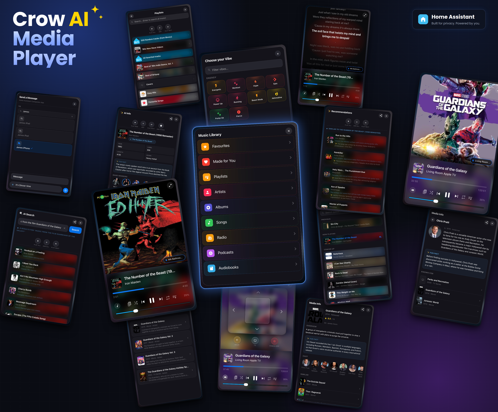

# CrowAI Media Player Card

CrowAI is a Home Assistant media player card built specifically for **iPhone**. Designed from the ground up for iPhone, it brings frosted-glass aesthetics, fluid touch animations, full Music Assistant integration, synced lyrics, a queue browser, multi-room multicast playback, rich AI-powered media info panels, movie and TV info, an Apple TV remote, and the option to play on the iPhone itself — all in a card that feels like a native iPhone app.

CrowAI is about **discovery** as much as playback — AI-powered info panels, recommendations, artist radio, similar tracks/shows/movies, AI-interpreted library search, Ask / Trivia panels, and personal Music Recap / Video Recap recaps all help you find your next favourite song, album, TV show or film, not just control what's already playing.

> **Music Assistant is required** for the Music Library browser, queue management, Vibe Queue Builder, AI Artist Radio, multi-room multicast playback and all MA-specific features.

> **Music Assistant Queue Actions is required** for the Recommended tab, Queue Browser and Library drill-in.

> **AI features are optional and off by default.** Turn on **Enable AI Features** in the editor's AI Settings to unlock them — they need a conversation agent such as Google Gemini. With AI off, the music info panel shows **Discogs** data, the movie/TV info panel uses **TMDB** if you add a free key, and everything else in the card works as normal.



## Key Features

- **Built for iPhone** — every interaction is optimised for iPhone; touch targets, long-press suppression and layout are all iPhone-first
- **Modern Design** — a **Classic** solid card or a **Glass** frosted-glass card, with an Auto / Light / Dark theme setting, rounded corners, smooth animations and customisable accent colours
- **Player Icon Themes** — eight icon sets: Standard, Modern, Robot (default), Chunky, Retro Player, Sharp, Pixel and LCD
- **Artwork Crossfade** — optional cinematic fade-to-black transition between track changes
- **Apple TV Remote** — built-in remote overlay with directional pad, Back, TV and Power Off; open it with the Remote button in the controls bar, or long-press the artwork during a show, movie or video app such as YouTube; tap ✕ or swipe down to close
- **Apple TV Remote Button** — on the left of the controls bar for Apple TVs (on by default, toggle in Appearance & Behaviour)
- **Music Library Button** — on the left of the controls bar on every other speaker, and on Apple TVs when the Remote button is off
- **Tactile Button Feedback** — glow and blur effects when buttons are pressed
- **Automatic Device Switching** — card follows whichever media player starts playing
- **Compact and Expanded Modes** — toggle between full album art and a space-saving mini player
- **Full Media Controls** — play/pause, track navigation, shuffle, repeat, seek and mute
- **Double-tap to Seek** — double-tap the left or right zone of artwork to seek −15s or +15s
- **Double-tap to Pin** — double-tap the *center* of the artwork to pin whatever's currently playing — a song, movie, TV show, or radio station — with a burst of red hearts floating up from the tap point (grey for unpinning; the heart burst can be turned off with the **Pin Hearts** toggle in Visual Effects, the pin itself always works). For radio, this uses the same station identification as the LIVE pill, so it only works once the station's been resolved (usually near-instant, but a station that's never been looked up this session may need a moment, or a tap of the LIVE pill first)
- **Pinned Indicator** — a small pin badge in the bottom-left corner of the artwork whenever the current track/movie/show/radio station is pinned, and stays live regardless of which of the card's pin buttons was used. Tap to unpin — shows an iOS-style confirmation first, then the same grey heart-burst as unpinning via double-tap
- **Artwork Tap Actions** — single-tap opens the info panel (music: AI Info or Discogs; TV/movies: Media Info; live radio with track metadata: that track's info); double-tap the left/right edge to seek −15s/+15s, double-tap the center to pin; long-press opens lyrics for music, or the Apple TV remote while a show, movie or video app is playing (or when nothing is showing on an Apple TV)
- **Artwork Zoom** — tap the mini album art in AI Info or album view to see a larger version
- **Mute Toggle** — tap the volume percentage badge or speaker icon to instantly mute/unmute
- **Live Progress Tracking** — real-time playback position updates
- **Multi-Device Management** — control Apple TV, HomePod and Music Assistant speakers from a single card
- **Play on This Device** — optional: turn the iPhone (or any browser) showing the card into a Music Assistant speaker, so music plays from the phone itself
- **Volume Control** — slider or +/− buttons, with optional per-speaker routing to a separate volume entity, configured on that speaker's own settings page in the editor
- **Speaker Display Names** — give any speaker a short friendly name on its settings page in the editor; used everywhere the card shows a speaker (speaker menu, summary pill, group sheets, Announce, toasts) while Home Assistant keeps the real name
- **Album Artwork** — automatic iTunes artwork lookup when no artwork is provided
- **Ambient Glow** — extracts dominant colour from album artwork and applies a subtle glow
- **Radio Mode Indicator** — tap the radio icon to turn radio mode off immediately
- **HA Radio Browser Integration** — browse Home Assistant's own Radio Browser categories (Popular, By Country, By Genre, etc.) directly from the Radio tab, alongside direct radio-browser.info search
- **Live/Podcast/Audiobook Pill** — optional badge identifying what's currently playing (off by default)
- **In-card Notifications** — toast alerts appear inside the card
- **Controls Theme** — 12 colour presets for the control icons (Classic, Vivid, Warm, Ocean, Rose, Forest, Neon, Soft, Midnight, Gold, Retro, Ember)

## AI Features

AI features are **off by default** — the card works fully without them, using Discogs for the info panel. Enable them with the **Enable AI Features** master switch at the top of the editor's **AI Settings**, then set up a conversation agent — **Google Gemini** is recommended.

**Setup (Google Gemini):**

1. In [Google Cloud Console](https://console.cloud.google.com), create or pick a project, go to **APIs & Services → Library** and **Enable** the **Generative Language API**. Don't skip this: an API key won't work until it's enabled.
2. Go to **APIs & Services → Credentials**, click **+ Create Credentials → API key** and copy the key.
3. In Home Assistant go to **Settings → Devices & Services → + Add Integration**, add **Google Generative AI** and paste your key. The recommended model settings work fine. If you choose a model yourself, pick a **current Flash model**, because Google retires older models regularly.
4. In the card's visual editor, open **AI Settings**, turn on **Enable AI Features**, and choose your Google AI agent under **AI Agent**.

Other conversation agents (Claude, OpenAI, Home Assistant's built-in AI, Ollama, etc.) may also work for general-knowledge features, but Gemini is recommended and best-tested.

**Rate limits:** free-tier limits vary by model and change over time, so check Google AI Studio for your current quota. The card caches AI answers for up to 30 days (and through app restarts with Persistent Info Storage on), so you're unlikely to reach the limit in normal use. If you do see a quota message, it resets the next day.

- **AI Info Panel** — single-tap the artwork while music plays: year, label, length, fun fact, genre tags, band members / artist section, album pill, up to 10 similar tracks; all cached per track. The header reads "AI Info" for an AI answer and "Discogs Info" when Discogs filled in. **Info Panel Priority** in AI Settings chooses whether AI or Discogs is tried first
- **Ask, Meaning and Trivia** — buttons in the music info panel: ask your own question about the song, read what it means, or try a quiz. Movie and TV panels have Ask, Mood Match and Trivia, episode pages have Ask, Trivia and Soundtrack, and person pages have Ask and Trivia
- **Discogs Panel** — the default info panel when AI features are off, and the automatic fallback when AI can't identify a track: year, label, length, tappable genre tags, artist section and a full tracklist with community rating, in the same layout. The header reads "Discogs Info" instead of "AI Info" so it's clear where the data came from; tapping a tracklist row opens that track's own info, and the row for the track you're viewing is highlighted. Built-in rate-limit protection backs off automatically for 10 seconds whenever Discogs asks the card to slow down.
- **Song Intro** — a short, intriguing one-line fact about the playing track appears below the artist name a few seconds after it starts, then fades away; off by default, toggle in AI Settings
- **Vibe Queue Builder** — 100+ vibes across Energy, Calm, Focus, Mood, Social, Decades, Genre, Time, Seasons and Binaural & Noise; builds a themed MA queue instantly; artist exclusion prevents repeats
- **Add Songs from Same Year / Genre / Genre & Year** — quick-menu actions that add AI-picked songs matching what's playing
- **Working indicator** — while the card is building or adding to a queue (Add Similar Songs, Same Year / Genre, AI Artist Radio, Vibe), a small spinner shows inside the mini artwork and the speaker pill on the artwork pulses. Both stop as soon as the songs are in. The first few songs are added straight away so the queue starts filling while the rest are found. The queue can't be opened mid-build: tapping it says your songs are still being added, and a message tells you when they're ready to see. If the queue is already open it shows "Building your queue" until they are
- **Friendly error messages** — if the AI or Music Assistant can't help, a short toast says why in plain English: the AI's usage limit has been reached, it took too long, it couldn't sign in, the model has been retired, no AI agent is chosen, its answer didn't make sense, or the songs couldn't be found in Music Assistant (including "Added 12 of 18 songs" when only some were found)
- **Mood Match and Trivia for video** — in the quick menu while a movie or show is playing
- **Ghost-Skip Healer** — when Music Assistant silently skips a track that failed to stream, the card looks it up again and queues the fresh match to play next (on by default)
- **AI Search** — natural language search, up to 18 results per query; available as a standalone panel, a box at the top of the library, and a dedicated AI search button next to the Songs, Artists and Albums tab search bars (returning matching tracks, artists or albums respectively); set **Library Search** to **AI Enhanced Search** to make pressing Search use AI too
- **Recent Searches** — a category at the top of the library listing every search you've run (MA, iTunes-backed and AI alike), capped at 50, most-recent-first; tap to re-run, with an iOS-style Clear confirmation
- **Recommendations** — AI-curated track/movie/show suggestions based on what's playing, up to 18 results
- **AI Artist Radio** — continuous radio queue around any artist
- **Find Soundtrack** — from the quick menu while watching on Apple TV, the long-press menu on Movies & TV items, or the Soundtrack button on Watch History titles and episode pages — opens an AI Search for that title's music
- **Open on YouTube / Trailer** — a button in the AI Info / Media Info panel header, next to Share: opens a YouTube search for the current song, or the trailer for a movie/TV show. Always YouTube specifically, regardless of your configured Share service. Toggle in Appearance & Behaviour
- **Announce AI Improve** — rewrites your announcement in a natural, friendly tone
- **Send Message AI** — improves your notification text
- **Audiobook search** — AI-assisted query refinement when searching LibriVox/Archive.org for public-domain audiobooks (plain search works without AI)
- **Music Recap** — a personal weekly snapshot of what you've been playing: top artists and tracks (last 7 days, top 10 each, expandable to 50) plus a short AI-written summary that regenerates fresh every time you open it
- **Video Recap** — the same idea as Music Recap, for movies and TV shows: top shows and top movies over the last 7 days plus a fresh AI-written summary every time you open it

## When AI Is Off or Can't Help

Every AI option (Search, Vibe, Recommendations, AI Artist Radio, the Add to Queue songs, Find Soundtrack, Ask, Trivia, Mood Match and the Announce / Send Message improve buttons) is hidden throughout the card while **Enable AI Features** is off, including in the quick menu, the queue's 3-dot menu and every long-press menu, and the card never contacts the AI agent. Where a panel normally gets its details from the AI, it falls back to a free source instead, both when AI is off and when the AI doesn't recognise something:

| What | Fallback |
|------|----------|
| Track info | Discogs |
| Album view (tracklist, year, label, genres) | Discogs |
| Movie and TV info | TMDB (with a key), then TVmaze for TV shows, then Wikipedia |
| TV seasons and episodes (counts, titles, air dates, summaries) | TVmaze |
| Artist, band member, cast and director bios | Wikipedia |
| Genre pill descriptions | Wikipedia |

None of these need an account or key apart from TMDB. Wikipedia results are kept for the session only, so turning AI back on gets the richer AI version next time; TVmaze lists are saved for 2 days while a show is airing and 7 days once it's ended, so new episodes and seasons appear quickly. TVmaze also fills in any details missing from an AI or TMDB TV panel, such as cast or overview, and a panel built entirely from TVmaze reads "TVmaze Info". The Year box in the music info panel opens "This year in music" only when AI is on; with AI off it shows the year as plain text.

**When the AI is struggling.** If the AI runs out of quota, keeps timing out, can't sign in or has no agent, the card pauses it and goes straight to the fallbacks above instead of waiting for each request to fail. A usage-limit pause lasts 2 minutes, then 10, then 30 if it keeps happening; two timeouts in a row pause it for 2 minutes; sign-in, model and agent problems pause it until the AI settings change or the page reloads. You get a single message when a pause starts, and **AI Settings** shows the current state with a **Try AI Again** button. Panels with a fallback give the AI 25 seconds to answer before using it. If the AI misses a particular track, tapping that track's artwork again later in the session opens the Discogs panel straight away, while the card quietly retries the AI once in the background so the full AI panel can return next time.


**Choosing which AI features run.** Under the master switch, **AI Settings** has an **AI Features** list so you can turn individual features off to save quota: **Info Panels**, **Look Up in Advance** (fetching AI info in the background before you tap; *off by default*), **Search and Recommendations**, **Ask, Meaning and Trivia**, and **Recap Summaries**. Anything switched off is hidden or falls back to the card's normal behaviour. When Ask, Meaning, Trivia or Mood Match can't get an answer, the panel shows a short reason ("Limit reached", "Busy right now", "No reply"…) with a **Try Again** button. A "busy" answer from the AI service is retried once automatically, identical requests already on their way are shared rather than sent twice, and every prompt tells the AI to treat titles, descriptions and web text strictly as data. If AI is on but no usable agent is chosen, AI Settings shows a warning under the AI Agent box.

## Quick Menu

Tap the playlist/queue button in the controls bar to open the contextual quick menu. Related actions are grouped into sub-menus so it fits on a phone screen: tap a group (shown with › and how many items it holds) to slide its items in, and ‹ at the top to go back. A group with only one item available shows that item directly, and the menu always fits on screen, scrolling if it needs to.

- **Find & browse** — Search (AI natural language search), Library, Queue (MA speakers only)
- **Discover & build** — Vibe, Recommendations, AI Artist Radio, Radio Mode, and **Add to Queue ›** (Similar Songs, Same Genre, Same Year, Same Genre & Year, This Album)
- **What's playing** — Lyrics, More Info, Pin / Unpin, Mood Match and Trivia (while a movie or show plays), Remote Control (Apple TV — opens or closes the remote), Find Soundtrack (while watching on Apple TV)
- **Recaps ›** — Music Recap, Video Recap
- **Share & Announce ›** — Share (track info plus a link to your chosen music service), Announce, Send Message

The AI entries (Search, Vibe, Recommendations, AI Artist Radio, the Add to Queue songs, Mood Match, Trivia, Find Soundtrack) only appear when **Enable AI Features** is on, and the same goes for the queue's 3-dot menu and every long-press menu.

## Speaker Selector Menu

Tap the broadcast icon to open a popup showing all configured media players. Tap any entry to switch. Speakers appear under their Display Name if you've set one on their settings page in the editor. With **Play on This Device** turned on, the menu also has **Play on this device** (see below).

## Play on This Device

Turn the browser showing the card — your iPhone, a tablet or a computer — into a Music Assistant speaker, using Music Assistant's **Sendspin** protocol. Needs **Music Assistant 2.10 or newer**.

- Turn on **Show "Play on this device"** in the editor's **Play on This Device** section
- Each device opts in separately: tap **Play on this device** in the speaker menu on that device. It joins Music Assistant with a name like "James's iPhone (Safari)" (the browser is included so two browsers on one phone never share a name; rename it in Music Assistant) and appears in the card like any other speaker
- **Browsers only** — it's offered in a web browser such as Safari, not in the Home Assistant Companion app. If the app was set up as a speaker by an earlier version of the card, it switches itself off; delete its leftover player in Music Assistant
- **Setting up** — the first time, the menu shows "Almost ready — adding this device to Home Assistant" for a few seconds, then "Ready — tap to play on this device" (it updates while the menu is open). If Home Assistant still hasn't found it after 90 seconds, the menu says so and offers **Choose this device yourself…** to pick its entity from a list
- **Connecting** — while it connects, the speaker pill reads "This device · Connecting…" and pulses, and a spinner shows in the mini artwork. A short toast marks the start, "Ready — playing on this device" when it's done, and a plain-English reason if it couldn't connect within 20 seconds. Reconnects in the background (for example coming back to Safari) stay quiet unless they take more than 3 seconds, when the pill shows "Reconnecting…"; you only get a toast if that fails
- Once it's the selected speaker, **Disconnect this device** turns it off again
- Only one browser tab plays at a time: if another tab took over, the menu offers to play here instead. If the tab that was playing has been closed or frozen by the phone, the next tab you use takes over by itself
- **Coming back** — after switching apps or returning to a frozen Safari tab, the card reconnects straight away and wakes the audio on your next tap, including when another app interrupted it
- **If a song won't resume** — pressing play checks that sound actually starts. If it doesn't, the card reconnects and asks again, then restarts the song from the same spot, and only as a last resort stops it with a message so you can simply play it again
- **Status** — when this device's audio needs waking, the speaker menu says so (for example "Audio was interrupted by another app. Press play to wake it.")
- **Locking the phone** — Safari pauses web pages when the iPhone locks, so music stops a few seconds later. That's a Safari limit; keep the screen on (or use a dedicated speaker) for longer listening
- Volume works as for any speaker: the card's slider changes this device's loudness, on top of the phone's own volume buttons. Each device remembers its own volume (and mute) between connections; the very first time it starts at 50% rather than full volume
- **Music Assistant server URL** — leave blank to use your Home Assistant host on Sendspin's port 8927 (not Music Assistant's web port 8095). If you open Home Assistant over https, this must be an https address too, or the browser will block the connection

## Multi-Room Multicast

Play the same audio on multiple MA speakers simultaneously:

- **Choose Speakers picker** — tap the broadcast icon to start a session: speakers are shown as a scrollable vertical list of pill rows (tap multiple to select for multicast); Play stays pinned at the bottom of the panel so a long speaker list never pushes it out of reach
- **Summary pill** — a single compact pill showing the focused speaker's name and a "+N" count of others in the group, instead of a separate pill per speaker
- **Tap to manage** — opens a sheet listing every speaker in the group as the same style of pill row; tap any to focus it for volume control, tap the × to remove it
- **Sync Volume** — a button in the sheet matches all grouped speakers to the focused speaker's volume
- **Add a speaker** — a "+" button appears next to the summary pill (and next to solo speakers, when others are available to group with) once something is actually playing
- Long-press menus for individual tracks/albums/etc. always target your current/default speaker directly rather than offering an in-menu speaker picker — use the "+" button to bring extra speakers into a multicast group instead
- Pre-configured Music Assistant player groups (e.g. a permanently-synced stereo pair) can be played on individually, but can't be folded into a separate multi-room session — a Music Assistant limitation, not a card one

## Pinning (Library)

Pin your favourites for one-tap access. All pins also live together in a consolidated **Pins** section in the library, with its own sub-categories: Songs, Artists, Albums, Playlists, Queues, Radio, Podcasts, Audiobooks, Music Recap, Video Recap and Movies & TV.

- **What can be pinned** — radio stations, podcasts, audiobooks, movies and TV shows, saved queues (see Pin Queue as Playlist below), recap snapshots, and MA library tracks, artists, albums and playlists
- **How to pin** — long-press any item (or use the pin icon in its info panel) and choose Pin/Unpin; for whatever's currently playing (a song, movie, TV show, or radio station), double-tapping the center of the artwork does the same thing instantly, with a heart-burst animation to confirm it. Unpin shows in red in every menu, and unpinning anything asks first with an iOS-style confirmation; pinned queues and recaps also warn that the snapshot can't be recreated
- **Show Pins in Sections** *(on by default)* — when enabled, pinned items also still appear inline at the top of their own tab (e.g. Pinned Songs in the Songs tab); turn it off in Caches & Data so pins only appear in the consolidated Pins section
- **Management** — view and clear pins individually or all at once from the visual editor's Caches & Data section
- Pins are stored on-device only by default and aren't synced between browsers or devices
- Enable **Persistent Pin Storage** in Caches & Data to also save pins to Home Assistant's database, so they survive app restarts and cache clears
- Clearing caches (individually or via Clear All Caches) still clears on-device pins — use **Clear Persistent Storage** to also remove the HA-side copy

## Pin Queue as Playlist

Save the current queue as a named snapshot from the queue's 3-dot menu — **Pin Queue**. It's a point-in-time copy (not a live link to the original queue) and shows up under **Queues** in the consolidated Pins section, ready to play back in full any time.

## Persistent Storage

By default, pins, AI lookups, iTunes artwork, Wikipedia photos and lyrics are cached in the browser only, which means they can be lost to WKWebView cache evictions or app restarts. Each of these can individually be switched to persistent storage in Caches & Data, which saves them to Home Assistant's own database instead:

- **iTunes Artwork**, **Wikipedia Artwork**, **Pinned Items**, **AI Info** (track info, bios, recommendations, etc.) and **Lyrics** each have their own Persistent Storage toggle
- Persistent data is loaded once per session and merged with the on-device cache — Home Assistant's copy always wins on conflict
- A **Clear Persistent Storage** button (separate from the regular cache-clear buttons) removes everything saved this way
- **Wikipedia photos** (cast, artists and band members) are also kept on the device after their first download, so they appear almost instantly on later visits, even after the app restarts. This needs Home Assistant to be opened over https (for example through Nabu Casa); over plain http they're downloaded again each session

## Synced Lyrics

Long-press the artwork while music is playing to open the full-screen lyrics panel. Single-tap to close.

- Real-time line highlighting with auto-scroll
- Double-tap to pause/resume auto-scrolling
- Plain lyrics fallback when timestamps aren't available
- Background prefetch — opens instantly
- Auto-close when track ends or changes

## Sharing

Share is available from the quick menu, the info panels, and the long-press menu on any queue row. It copies everything to the clipboard — there's a toast confirmation when it's done. In the info panels, the share button in the header opens a small menu instead: **Copy to Clipboard** (the same as Share), **Export Info to PDF** and, for music with lyrics, **Export Lyrics to PDF** (see [Export to PDF](#export-to-pdf)).

- **Music** — copies the track title and artist (plus album, where shown) along with a link to find the track on your chosen streaming service
- **Movies & TV** — copies the title, year and a short synopsis along with a link to find it on TheMovieDB
- **Choose your service** — pick the destination for music links in AI Settings: YouTube Music (default), Apple Music, Spotify, Tidal, Amazon Music or Deezer

## Export to PDF

The share button at the top of every info panel (music, Discogs, album, movie and TV, season and episode, person, podcast, station and audiobook) opens a menu with **Export Info to PDF**. A preview opens straight away with a spinner, then shows the finished PDF with a **Download** button.

- **Music and other panels** — the title and artist as the heading, the artwork beside the grey Year / Label / Length / Genre rows, then everything else on screen in order: Fun Fact, Band Members on one line, Similar Tracks in two columns, tracklists, and anything you've opened with Ask, Meaning or Trivia. Web addresses (a station's website or stream) are clickable
- **Movies and TV** — the title and year as the heading, the poster beside the user-score ring and grey Type / Seasons / Creator or Director / Genre / Rated rows, then Overview, Fun Fact, Cast in columns, Where to Watch and Similar
- **Export Lyrics to PDF** — appears in music panels when the track has lyrics (looked up when the menu opens if they aren't already known). The song and band as the heading, the artwork beside the grey detail rows, then the lyrics centred, running onto further pages as needed

The PDF library (jsPDF) loads from a CDN the first time you export. Artwork that a site won't let the card copy is fetched through the images.weserv.nl image proxy; if that fails too, the PDF is made without it. The PDF's built-in fonts only cover Western characters, so emoji and non-Latin text are left out. In the Home Assistant app on iPhone the Download button may not save the file, depending on the app version; it works in Safari.

## Media Info Panels

**Single-tap** the artwork to open the relevant info panel.

**Music — AI Info Panel:**
- Year, label, length, fun fact, genre tags
- Album pill — tap to open the album and browse its tracks; tap album art to zoom
- Band Members / Artist — tap any member to open their bio with photo (tap to zoom), Known For songs and fun fact
- Similar Tracks — tap to drill in, long-press for the enqueue menu
- Mini album art — tap to see a larger version
- Action bar: Play Now, Add, Play Next, Add Album
- **Ask / Meaning / Trivia** (AI) — ask your own question about the song, read its meaning, or try a quiz
- **Discogs Panel** — the default panel when AI features are off, and the automatic fallback if AI has no info for a track: same layout with a full tracklist and community rating added; the header reads "Discogs Info" rather than "AI Info". Tapping a track in the Discogs tracklist opens that track's own info — the track the panel is showing is highlighted in the tracklist, tapping it jumps back to the top of the panel, and every newly opened track starts at the top. The album pill opens the album view, filled straight from the Discogs release, and Back returns to the track exactly as you left it
- **Artist bios** — the AI bio when AI is on, otherwise the Wikipedia summary (marked "From Wikipedia")

**TV Shows:**
- Poster (tap to zoom), genre tags, overview, cast
- Similar Shows — same idea as Similar Tracks; tap any to drill straight into that show's info
- Season and episode browser with episode counts and formatted airdates (from TVmaze when AI is off or doesn't know the show); new seasons appear as soon as TVmaze lists them, and the lists are cached so going back and forth doesn't reload
- Episode pages with the show's artwork, a Season and Episode label, the episode title, air date and rating, and tappable writer and director pills, then the description and fun fact; with AI on, Ask, Trivia and Soundtrack buttons sit under the artwork
- Full back-navigation from episode detail all the way back to the Media Info panel, returning to the same scroll position
- **Ask / Mood Match / Trivia** (AI) and **Where to Watch**
- Cast member bios with photo zoom

**Movies:**
- Poster (tap to zoom), title, year, genre tags, synopsis, cast
- Similar Movies — same idea as Similar Tracks; tap any to drill straight into that movie's info
- **Ask / Mood Match / Trivia** (AI) and **Where to Watch**
- Cast member bios with photo zoom

**Movies & TV sources:** add a free **TMDB** API key in the editor's **Movies & TV** section for posters, ratings, cast and episode details. With AI off, TMDB is always used (a key is required for movie/TV info then); with AI on, **Movie/TV Info Priority** picks which is tried first. If the wrong title was identified, **Not this one?** lets you pick another match.

**Cast navigation:** tap any cast member to open their person page with bio, photo (tap to zoom), Known For credits and a fun fact — the same related-content pattern used throughout the card. With AI off, or when the AI doesn't know the person, the bio comes from Wikipedia. The panel header shows a back button and the person's name while the bio is open.

**Find Soundtrack (AI):** available from the media player's quick menu while watching on Apple TV, the long-press menu on Movies & TV items, and the Soundtrack button on Watch History titles and episode pages — opens an AI Search for that title's music.

## Queue Panel

- Now Playing row with animated sound bars — tap to open AI Info
- Drag to reorder (MA only, requires Queue Actions integration)
- Long-press any row: Play Now, Play Next, Move to Top of Queue, Add to Queue, Pin Song, AI Artist Radio, Remove from Queue (with an iOS-style confirmation), Share, More Info
- Long-press also offers **Reorder Queue** to switch into drag-to-reorder mode
- Queue 3-dot menu, grouped like the quick menu: Reorder, Jump to Current Track, Pin Song, **Pin Queue**, **Transfer Queue** (move the queue to another MA speaker) · Search, Library · Vibe, Recommendations, AI Artist Radio, Radio Mode, **Add to Queue ›** (Similar Songs, Same Genre, Same Year, Same Genre & Year, This Album) · **Share & Announce ›** (Announce, Send Message) · Clear Queue

## Announce

- Speaker search grouped by HA area
- Global and per-speaker volume control
- Pause and resume playing speakers automatically
- Announcement history with favourites
- AI improve button (shown only when AI features are enabled)

## Send Message

Push notifications to iPhones running the HA Companion App:

- Multi-device selection with live search
- Custom subject/heading
- AI improve button (shown only when AI features are enabled)

## Music Assistant Library Browser

Categories: Recent Searches, Music History, Watch History, Recently Added, Pins, Favourites, Made for You (Recommended), Playlists, Artists, Albums, Songs, Radio, Podcasts, Audiobooks, Movies & TV. The library opens from **Library** in the quick menu on any speaker, MA or not — several categories (Movies & TV, Radio, Podcasts, Audiobooks) don't need Music Assistant at all.

- Tap any item to play; drill into collections with a back button
- Action bar on every drill-down: Play All, Add to Queue, Play Next
- Long-press tracks for the enqueue menu
- **AI Search** — a box at the top of the library, plus a dedicated AI search button next to the search bar on the Songs, Artists and Albums tabs (returning matching tracks, artists or albums specifically)
- **Recent Searches** — every search you've run, MA and AI alike, most-recent-first, capped at 50; tap to re-run, with an iOS-style Clear confirmation
- **Music History** — a plain chronological list of your last 10 songs played; the 3-dot menu expands the same view to your last 50, or clears history entirely (iOS-style confirmation). A hero bar (Play All / Add All / Play Next) acts on exactly whichever count is currently showing. Tap a song for its AI Info, long-press for the same context menu used throughout the library (Play Now/Next, Add to Queue, Pin, AI Artist Radio, Share), plus **Remove from History**, **Remove All Plays** (every play of that song; only shown when it's been played more than once) and **Never Log This Artist**, each with an iOS-style confirmation (unmute them from **Muted Artists** in the 3-dot menu). Pinning here lands in the same Pins → Songs category as pinning anywhere else. Reads from the same history log as Music Recap below — just as a list instead of weekly stats — so clearing history from either one clears it for both
- **Watch History** — the movie/TV equivalent, same shape: last 10 (expandable to 50), 3-dot menu with Clear History. Long-press a title for Pin, Find Soundtrack and **Remove from History** (removes every watch of it, with an iOS-style confirmation), or open a title and long-press a viewing to remove just that one (also confirmed). Reads from the same history as Video Recap. No hero bar — replaying movies/shows back-to-back isn't the natural action for video the way it is for songs
- **Podcasts tab** — search iTunes directly; pin favourites
- **Audiobooks tab** — search free, public-domain titles on LibriVox via the Archive.org catalogue, with AI-assisted query refinement and chapter-by-chapter playback; pin favourites
- **Radio tab** — search radio-browser.info directly, or use Browse Home Assistant Radio to explore categories from HA's own Radio Browser integration (requires the [Radio Browser](https://www.home-assistant.io/integrations/radio_browser/) integration under Settings → Devices & Services)
- **Movies & TV** — search movies and TV shows, open their info and pin favourites
- **Pins** — everything you've pinned, grouped into Songs, Artists, Albums, Playlists, Queues, Radio, Podcasts, Audiobooks, Music Recap, Video Recap and Movies & TV
- **Remembers where you left off** — reopening the library returns to whichever tab you were last in, even after fully closing and reopening the app (within a few hours; a deliberate close resets it back to the top)

## Radio Mode

Enable from the quick menu, or switch on **Default Radio Mode on Startup** in the visual editor (off by default) to have it on whenever the card loads. Turning it on from the quick menu lasts for that session only. MA automatically queues similar songs after each track. Turns off automatically when switching to a non-MA speaker or clearing the queue.

**Live station identification:** a LIVE pill appears on the artwork while a radio stream plays, on any speaker type (MA or native). Tap it to see the station's format, country, votes, website and description; the artwork also automatically resolves to the station's own logo when available. Stations played straight from the Music Assistant library are identified from MA itself, so their panel opens (fully playable and pinnable) even when radio-browser.info doesn't know them. When a station broadcasts real track metadata (artist + title), tapping the *artwork* opens that track's own info panel with the station shown as a badge — the LIVE pill itself always opens the station panel.

## Music Recap

Open from the quick menu for a personal snapshot of your recent listening.

- **Top Artists & Top Tracks** — top 10 each, ranked by play count over a rolling last-7-days window; **Show Top 50** in the 3-dot menu expands both lists
- **3-dot menu** — Show Top 50 / Show Top 10, Play All, Add, Play Next, **Pin This Music Recap** and Clear Listening History
- **Pin This Music Recap** — saves a frozen snapshot (like Pin Queue, not a live link) under Music Recap in the Pins section; long-press a pinned recap to rename it
- **AI summary** — a short, warm write-up of your week's listening, regenerated fresh every time the panel opens (not cached, so it always matches the numbers below it). Requires AI features to be enabled — the stats themselves work without AI
- **Tap a track** to open its AI Info panel; **tap an artist** to open their bio — the same panels used throughout the card
- **What counts as a play** — a track has to play past 30 seconds or half its duration (whichever is smaller) to be logged, so quick skips don't pollute your stats
- **What's excluded** — radio streams, podcasts, audiobooks, and system/notification sounds (e.g. announcements) never count toward your Recap
- **Which entities count** — any entity listed in this card's `entities` or `ma_entities` config, not MA-only. Whichever one is actively reporting as playing at a given moment is used, so a speaker with both a native and an MA entity is covered by either
- **Shared across rooms on the same device** — logging is scoped to whatever entities a card is configured with, but the Recap panel itself doesn't filter by entity when displaying results. If you run separate cards per room on the same phone/browser, they all read from one shared history, so every card's Recap shows the combined total of everything any of your cards have logged — not a breakdown per room
- **Catches up on missed plays** — each time a card loads, it also pulls that entity's own state history from Home Assistant (not just what it observes live) to backfill anything played while that card wasn't open — e.g. a different room's tab was active at the time. This needs Home Assistant's recorder to actually be tracking the entity; it looks back up to 48 hours on a card's first-ever load, then only as far as its last check after that
- **Per-user** — if you and other household members use separate Home Assistant accounts, each person's Recap is tracked and stored separately, the same way Pins are
- **Clear Listening History** — in the 3-dot menu (with an iOS-style confirmation); permanently deletes your history and resets the history-backfill checkpoint, so cleared plays don't get silently reinstated the next time a card loads; enable **Persistent Info Storage** in Caches & Data so this history survives app restarts and WKWebView cache evictions. Same history Music History reads from, so clearing either one clears both

## Video Recap

The same idea as Music Recap, but for movies and TV shows.

- **Top Shows & Top Movies** — ranked by play count over a rolling last-7-days window; top 10 each, expandable to 50 from the 3-dot menu
- **Pin This Video Recap** — saves a snapshot under Video Recap in the Pins section
- **AI summary** — a fresh, warm write-up of the week's viewing, regenerated every time the panel opens; requires AI features to be enabled — the stats themselves work without AI
- **Tap a title** to open its Media Info panel
- **What's excluded** — entries that turn out to just be a bare date (some sources report a recording's date instead of a real title when no title metadata is available) are filtered out automatically, both going forward and retroactively from anything already logged
- **Clear Watch History** — in the 3-dot menu, with the same iOS-style confirmation; enable **Persistent Info Storage** in Caches & Data so this history survives app restarts. Same history Watch History reads from, so clearing either one clears both

## Apple TV Remote

**Opening the remote** — tap the **Remote** button on the left of the controls bar, long-press the artwork while a show or movie is playing on an Apple TV (or when nothing is showing), or choose **Remote Control** from the quick menu. In compact mode the card expands first. Music keeps its own long-press for lyrics. Anything playing in a video app such as YouTube, Netflix or iPlayer counts as video, even when the app reports a channel name as the artist, so long-press opens the remote rather than lyrics.

**Back to the artwork** — tap the **✕** in the top-left corner of the remote, swipe down on the remote, long-press an empty part of it, or choose **Remote Control** in the quick menu again. Swipes that start on the clickpad or the apps list are ignored, and upward swipes still scroll the dashboard.

| Button | Action |
|--------|--------|
| **Back** | Navigate back / menu |
| **TV** | Home screen / wakes from sleep |
| **Power Off** | Sends `suspend` to sleep the Apple TV |

**Keyboard Panel** — while the remote is open, the moment an Apple TV's on-screen keyboard becomes active (searching in an app, entering a password, etc.), a text input automatically appears over the card. Type on your phone's own keyboard and tap Send to push the text straight to the TV, instead of the actual remote's slow letter-by-letter D-pad entry. Detected via Home Assistant's own entity registry (finds whichever binary_sensor shares the same device as your Apple TV entity, so it works regardless of how entities happen to be named) — no setup needed beyond having the Apple TV integration configured. Toggle in Appearance & Behaviour.

## Installing Music Assistant — Required

The recommended way to run Music Assistant is as a Home Assistant **App** (formerly called an add-on), available directly in the built-in App store on Home Assistant OS installations.

1. In Home Assistant, go to **Settings → Apps**
2. Click **Install app** and search for **Music Assistant**
3. Select it, click **Install**, then start it once installed
4. After it starts, go to **Settings → Devices & Services → + Add Integration**, search for **Music Assistant** and follow the setup wizard to connect the integration to the running app
5. Open the Music Assistant web interface to add your music providers (Spotify, Apple Music, local library, Tidal, etc.) and players (HomePod, Sonos, AirPlay, Chromecast, etc.)
6. MA-managed players appear in HA as `media_player.mass_*` entities — use these in the card's `ma_entities` config

> **Apple Music is the preferred provider.** Connect a streaming provider to Music Assistant rather than relying on a local library alone — **Apple Music is the recommended choice** for this card, giving the most reliable catalogue, metadata and artwork matches. Spotify, YouTube Music, Tidal and others are also supported, but Apple Music is the safest choice if you're picking one. Recommendations, the Vibe Queue Builder, AI Artist Radio and Similar Tracks all suggest music that needs to actually be playable through MA — a streaming provider gives them a full catalogue to draw from instead of just what you already have.

GitHub: [github.com/music-assistant](https://github.com/music-assistant) · Documentation: [music-assistant.io](https://music-assistant.io)

## Music Assistant Queue Actions Integration — Required

The Recommended tab, Queue Browser and Library drill-in all require the [Music Assistant Queue Actions](https://github.com/droans/mass_queue) (`mass_queue`) integration. When installed it enables:

- Personalised recommendations in the Recommended tab
- Full queue history and upcoming tracks in the Queue Browser
- Real-time queue updates — the queue panel refreshes automatically when tracks change
- Single-item atomic reordering via `move_queue_item_next` — only the dragged track is moved
- Clean queue item removal via `remove_queue_item`
- Track listing when drilling into albums, artists, playlists and podcasts

**To install:**
1. Open **HACS** → click ⋮ → **Custom repositories**
2. Add `https://github.com/droans/mass_queue` as an **Integration** repository
3. Search for **Music Assistant Queue Actions**, download, and restart HA — the card detects it automatically

Repository: [github.com/droans/mass_queue](https://github.com/droans/mass_queue)

## Smart Device Detection

- **Apple TV** (`device_class: tv`) — Remote button in the controls bar (or long-press the artwork), volume via `remote.send_command`
- **HomePod** (`device_class: speaker`) — no remote, soft-mute
- **Music Assistant** (`platform: music_assistant`) — full MA queue and library features
- **Alexa / all others** — no remote, standard controls
- **Every other speaker** — music library button in the controls bar (turn off **Always Show Library Button** to hide it); Apple TVs get it too when the Remote button is off

## Visual Configuration Editor

The editor includes a filter box at the top (search any setting by name) and a Reset All Settings to Defaults button. Several sections are collapsible.

- **Manage & Reorder Media Players** — accordion list with drag-and-drop reordering; enable/disable per speaker; tap a speaker's name to open its own dedicated settings page (Display Name, Startup Volume, Volume Entity, MA Speaker toggle)
- **Play on This Device** — Show "Play on this device" and the Music Assistant server URL
- **Appearance & Behaviour** *(collapsible)* — General (Follow HA Theme, Always Show Library Button, Apple TV Remote Button, Apple TV Keyboard Panel, Default Radio Mode on Startup (off by default), iTunes Artwork Fallback, Live/Podcast/Audiobook Pill, Show YouTube Button, Scroll Long Text), Volume (Volume HUD, Volume Buttons, Volume Percentage) and Startup & Navigation (Auto Switch, Remember Last Speaker, Media Player Selector, Startup View, Retain Current View, Remote Button Row Position)
- **Caches & Data** *(collapsible)* — AI caches (bios, trivia, where-to-watch, content warnings, year-in-music, vibe history, AI response cache), artwork caches (iTunes, Wikipedia) with Persistent Storage toggles, library & radio caches (MA library, radio stations, HA registry), Lyrics (line style, Keep Lyrics Open Between Tracks, Cache Lyrics, Save Lyrics For, Persistent Lyrics Storage), pinned items (Persistent Pin Storage, Show Pins in Sections, Clear All Pins), TV Episode Cache (season counts, episode lists and episode details from the AI and TVmaze), Persistent Info Storage, Clear All Caches and Clear Persistent Storage
- **Visual Effects** — Style (Classic or Glass), Theme (Auto, Light or Dark), Remote Liquid Glass, Volume HUD Liquid Glass, Ambient Glow, Row Glow, Artwork Crossfade, Pin Hearts, Resize Button Spin
- **AI Settings** — **Enable AI Features** master switch (off by default), AI Agent (Google Gemini recommended), Info Panel Priority, Library Search (Normal or AI Enhanced), Share Track Service (YouTube Music, Apple Music, Spotify, Tidal, Amazon Music, Deezer), Announce TTS Service, Song Intro, Ghost-Skip Healer, the **AI Features** switches (Info Panels, Look Up in Advance (off by default), Search and Recommendations, Ask, Meaning and Trivia, Recap Summaries), a warning when no usable AI agent is chosen, and an AI status row with **Try AI Again** whenever the AI is paused
- **Movies & TV** — TMDB API Key, Movie/TV Info Priority
- **AI Vibe Artist Seeds** — customisable playlist search terms and radio fallback artist per vibe category
- **Colours & Themes** *(collapsible)* — Controls Theme (12 presets), Player Icon Theme (8 sets), Accent Preset, accent, volume, title, artist, button, +Add pill, volume % and custom background/lyrics colours with live preview strip

## Installation

Install via **HACS** (recommended):

1. Open **HACS** in Home Assistant → **Frontend** tab
2. Click ⋮ → **Custom repositories**, add `https://github.com/jamesmcginnis/crowai-media-player-card` as a **Lovelace** repository
3. Search for **CrowAI Media Player Card** and click **Download**
4. Restart Home Assistant, then close and reopen the HA app on your iPhone

Or download `crowai-media-player-card.js` from the [Releases](../../releases/latest) page, copy to `/config/www/`, and add `/local/crowai-media-player-card.js` as a **JavaScript module** resource under **Settings → Dashboards → Resources**.

## Quick Start

```yaml
type: custom:crowai-media-player-card
entities:
  - media_player.living_room_apple_tv
  - media_player.living_room_homepod
  - media_player.mass_living_room
ma_entities:
  - media_player.mass_living_room
ai_features_enabled: true
ai_conversation_agent: conversation.google_generative_ai
tmdb_api_key: YOUR_TMDB_KEY
accent_color: '#007AFF'
controls_theme: classic
startup_volume: 35
use_ha_theme: false
lyrics_scroll_mode: highlight
lyrics_cache_enabled: true
lyrics_cache_ttl: 7
ma_library_cache_enabled: true
ma_library_cache_ttl: 1
ma_radio_mode: false
icon_theme: robot
artwork_crossfade: false
ambient_glow: false
row_glow: false
show_media_type_pill: false
song_intro_enabled: true
card_liquid_glass: true
show_pins_in_sections: true
```

> **Note:** `ma_entities` should list your MA speaker entities (e.g. `media_player.mass_kitchen_homepod`). These do **not** need to also appear in `entities`. AI features are **off by default** — the example above enables them; leave `ai_features_enabled` out (or set it `false`) for a Discogs-powered card with no AI. `tmdb_api_key` is optional; leave it out if you don't use movie/TV info without AI.

## Data Sources

Music data from [Discogs](https://www.discogs.com), TV episode data from [TVmaze](https://www.tvmaze.com) (CC BY-SA), movie and TV data from [TMDB](https://www.themoviedb.org), biographies and photos from [Wikipedia](https://www.wikipedia.org), artwork from iTunes, radio stations from [radio-browser.info](https://www.radio-browser.info) and audiobooks from [LibriVox](https://librivox.org).
